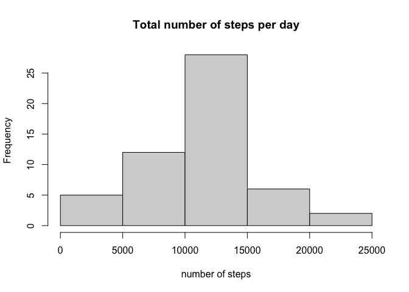
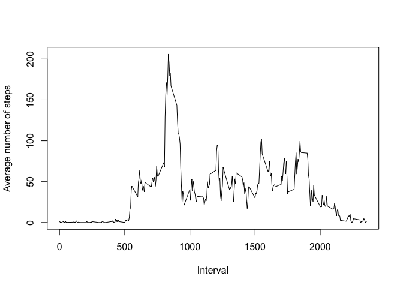
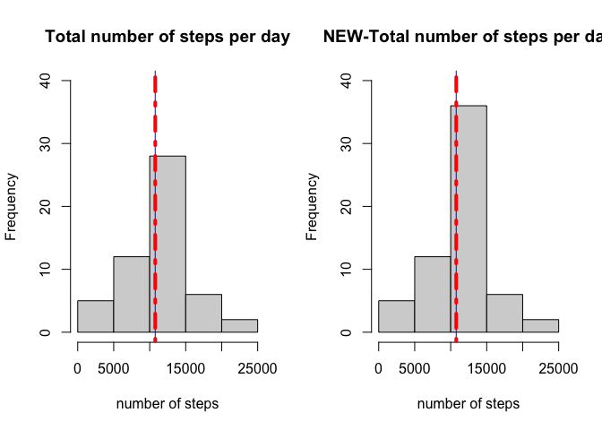
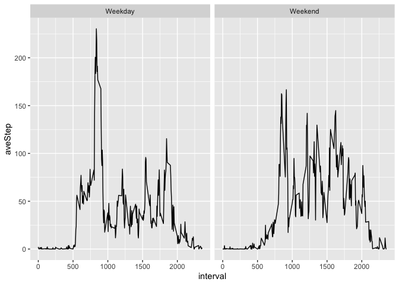

## Loading and preprocessing the data
### 1 Load the data 

```r
unzip(zipfile = 'activity.zip')
data=read.csv(file ='activity.csv')
```
### 2 Process/transform the data (if necessary) into a format suitable for your analysis

```r
rownames(data)=1:nrow(data) #add row names

data$date<-as.Date(data$date,'%Y-%m-%d')# transform the date to 'date' format
head(data)
```

```
##   steps       date interval
## 1    NA 2012-10-01        0
## 2    NA 2012-10-01        5
## 3    NA 2012-10-01       10
## 4    NA 2012-10-01       15
## 5    NA 2012-10-01       20
## 6    NA 2012-10-01       25
```


## What is mean total number of steps taken per day?

### 1.Make a histogram of the total number of steps taken each day


```r
totalDay<-aggregate(steps~date,data,sum)
head(totalDay)
```

```
##         date steps
## 1 2012-10-02   126
## 2 2012-10-03 11352
## 3 2012-10-04 12116
## 4 2012-10-05 13294
## 5 2012-10-06 15420
## 6 2012-10-07 11015
```

```r
hist(totalDay$steps,xlab = 'number of steps',main='Total number of steps per day')
```

<!-- -->

### 2. Calculate and report the mean and median total number of steps taken per day

```r
meanDaytotal<-mean(totalDay$steps,na.rm = T)
medianDaytotal<-median(totalDay$steps,na.rm = T)
meanDaytotal
```

```
## [1] 10766.19
```

```r
medianDaytotal
```

```
## [1] 10765
```


The mean total number of steps taken per day is  1.0766189\times 10^{4}
The median total number of steps taken per day is  10765

## What is the average daily activity pattern?
### 1.Make a time series plot (i.e. type = "l") of the 5-minute interval (x-axis) and the average number of steps taken, averaged across all days (y-axis)


```r
library(dplyr)
```

```
## 
## Attaching package: 'dplyr'
```

```
## The following objects are masked from 'package:stats':
## 
##     filter, lag
```

```
## The following objects are masked from 'package:base':
## 
##     intersect, setdiff, setequal, union
```

```r
agg<-aggregate(steps~interval,data = data,FUN=mean)
MeanDF<-rename(agg,'meanSteps'='steps')
head(MeanDF)
```

```
##   interval meanSteps
## 1        0 1.7169811
## 2        5 0.3396226
## 3       10 0.1320755
## 4       15 0.1509434
## 5       20 0.0754717
## 6       25 2.0943396
```

```r
plot(agg$interval,agg$steps,type = 'l',xlab = 'Interval',ylab = 'Average number of steps')
```

<!-- -->


### 2.Which 5-minute interval, on average across all the days in the dataset, contains the maximum number of steps?

```r
maxInt<-agg[which(agg$steps==max(agg$steps)),][['interval']]
maxInt
```

```
## [1] 835
```
The interval 835 contains the maximum number of steps.

## Imputing missing values

### 1.Calculate and report the total number of missing values in the dataset (i.e. the total number of rows with NAs)

```r
NumNA<-sum(!complete.cases(data))
NumNA
```

```
## [1] 2304
```
The total number of missing values in the dataset is 2304  

### 2.Devise a strategy for filling in all of the missing values in the dataset. The strategy does not need to be sophisticated. For example, you could use the mean/median for that day, or the mean for that 5-minute interval, etc.
Ans: 
I imputed the NA with the mean for that 5-minute interval.

### 3.Create a new dataset that is equal to the original dataset but with the missing data filled in.

```r
mid<-merge(x=data,y=MeanDF,by='interval',all=T);
mid[!complete.cases(mid),]$steps=mid[!complete.cases(mid),]$meanSteps
newData<-arrange(mid,date,interval)[,c('steps','date','interval')]
head(newData)
```

```
##       steps       date interval
## 1 1.7169811 2012-10-01        0
## 2 0.3396226 2012-10-01        5
## 3 0.1320755 2012-10-01       10
## 4 0.1509434 2012-10-01       15
## 5 0.0754717 2012-10-01       20
## 6 2.0943396 2012-10-01       25
```
### 4.Make a histogram of the total number of steps taken each day and Calculate and report the mean and median total number of steps taken per day. Do these values differ from the estimates from the first part of the assignment? What is the impact of imputing missing data on the estimates of the total daily number of steps?


```r
NewtotalDay<-aggregate(steps~date,newData,sum)
head(NewtotalDay)
```

```
##         date    steps
## 1 2012-10-01 10766.19
## 2 2012-10-02   126.00
## 3 2012-10-03 11352.00
## 4 2012-10-04 12116.00
## 5 2012-10-05 13294.00
## 6 2012-10-06 15420.00
```

```r
par(mfrow=c(1,2))

hist(totalDay$steps,xlab = 'number of steps',main='Total number of steps per day',ylim = c(0,40))
abline(v=mean(totalDay$steps),col='blue')
abline(v=median(totalDay$steps),col='red',lwd=4,lty=22)
hist(NewtotalDay$steps,xlab = 'number of steps',main='NEW-Total number of steps per day',ylim = c(0,40))
abline(v=mean(NewtotalDay$steps),col='blue')
abline(v=median(NewtotalDay$steps),col='red',lwd=4,lty=22)
```

<!-- -->

```r
newMeanDaytotal<-mean(NewtotalDay$steps,na.rm = T)
newMeanDaytotal
```

```
## [1] 10766.19
```

```r
newMedianDaytotal<-median(NewtotalDay$steps,na.rm = T)
newMedianDaytotal
```

```
## [1] 10766.19
```
The *new* mean total number of steps taken per day is 1.0766189\times 10^{4} and median total number of steps taken per day is 1.0766189\times 10^{4}, while the *original* values are 1.0766189\times 10^{4} and 10765 respectively. Those values do not differ significantly, therefore,the impact of imputing missing data on the estimates of the total daily number of steps is insignificant.


## Are there differences in activity patterns between weekdays and weekends?

### 1.Create a new factor variable in the dataset with two levels – “weekday” and “weekend” indicating whether a given date is a weekday or weekend day.


```r
WD=weekdays(newData$date)
fac<-WD %in% c('Sunday','Saturday')

newData$fac<-factor(fac,labels = c('Weekday','Weekend'))
head(newData)
```

```
##       steps       date interval     fac
## 1 1.7169811 2012-10-01        0 Weekday
## 2 0.3396226 2012-10-01        5 Weekday
## 3 0.1320755 2012-10-01       10 Weekday
## 4 0.1509434 2012-10-01       15 Weekday
## 5 0.0754717 2012-10-01       20 Weekday
## 6 2.0943396 2012-10-01       25 Weekday
```

### 2.Make a panel plot containing a time series plot (i.e. type = "l") of the 5-minute interval (x-axis) and the average number of steps taken, averaged across all weekday days or weekend days (y-axis). See the README file in the GitHub repository to see an example of what this plot should look like using simulated data.

```r
library(dplyr)

plotdata<-newData%>%group_by(fac,interval) %>%
        summarise(aveStep=mean(steps))
```

```
## `summarise()` regrouping output by 'fac' (override with `.groups` argument)
```

```r
plotdata
```

```
## # A tibble: 576 x 3
## # Groups:   fac [2]
##    fac     interval aveStep
##    <fct>      <int>   <dbl>
##  1 Weekday        0  2.25  
##  2 Weekday        5  0.445 
##  3 Weekday       10  0.173 
##  4 Weekday       15  0.198 
##  5 Weekday       20  0.0990
##  6 Weekday       25  1.59  
##  7 Weekday       30  0.693 
##  8 Weekday       35  1.14  
##  9 Weekday       40  0     
## 10 Weekday       45  1.80  
## # … with 566 more rows
```


```r
library(ggplot2)
ggplot(plotdata,aes(interval,aveStep))+geom_line()+facet_grid(. ~ fac)
```

<!-- -->


